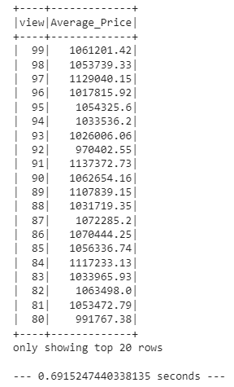

# Home_Sales
In this challenge, key metrics about home sales data were reviewed by using PySpark and Spark SQL within the Google Colab environment.

# Google_Colab_Link
https://colab.research.google.com/drive/1I6LhBy5qIdBF7VYySA-OUx2a7ku-4D2B?usp=sharing

# Key_Metrics_Reviewed
1. What is the average price for a four-bedroom house sold for each year? Round off your answer to two decimal places.

2. What is the average price of a home for each year it was built that has three bedrooms and three bathrooms? Round off your answer to two decimal places.

3. What is the average price of a home for each year that has three bedrooms, three bathrooms, two floors, and is greater than or equal to 2,000 square feet? Round off your answer to two decimal places.

4. What is the "view" rating for homes costing more than or equal to $350,000? Determine the run time for this query, and round off your answer to two decimal places.
* Original Data

* Cached Data

* Parqueted Data

# Results
In summary, the order of runtime efficiency is as follows: Parqueted data, Cached data, and Original data.
